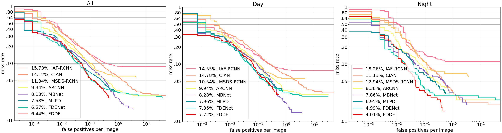
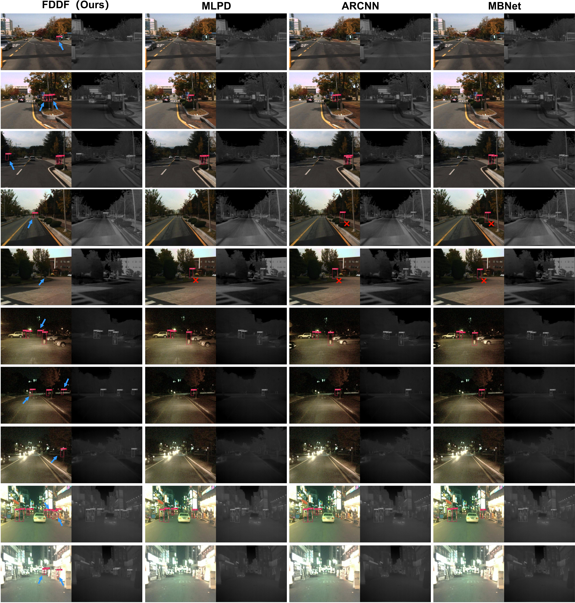

# FDDF
FDDF: Frequency Decomposition and Spatial-Frequency Dual-Domain Fusion Network for Multi-Spectral Pedestrian Detection

# FDDF: Frequency Decomposition and Spatial–Frequency Dual-Domain Fusion Network

This repository contains a reference implementation of the core modules of **FDDF** (Frequency Decomposition and Spatial–Frequency Dual-Domain Fusion Network) for multispectral pedestrian detection. The method is described in our paper:

> X. Liu, G. Xie, X. Xie, and X. Xu,  
> **"FDDF: Frequency Decomposition and Spatial-Frequency Dual-Domain Fusion Network for Multi-Spectral Pedestrian Detection"**,  

The repository currently includes the four key building blocks of our dual domain fusion paradigm, as well as the content of data labeling, training, and data processing:

- **fdfd**: Frequency-Domain Feature Decomposition Module  
- **fsc**: Frequency–Spatial Domain Feature Global Co-occurrence Module
- **sdci**: Spatial-Domain Cooperative Integration Module
- **fsa**:Frequency Spectrum Attention Operation Module

Baseline Code and External References

Our implementation is built on top of existing open-source multispectral pedestrian detection codebases. In particular:

The training and detection pipeline (VGG-16 backbone + SSD detector, data loading, augmentation, and loss functions) is adapted from the official implementation of MLPD (“Multi-Label Pedestrian Detector in Multispectral Domain”) [Kim et al., RA-L 2021].https://github.com/sejong-rcv/MLPD-Multi-Label-Pedestrian-Detection.git

Some utility functions (e.g., anchor generation, evaluation scripts) follow the design of standard SSD implementations in PyTorch.

You can quickly evaluate the results by running evaluation_stcript.py
FDDF_desult. txt is the result of this article on Kaist
KAIST-annotation.json is a validation set label
KASIT_SENCHMARK.jpg is a comparison chart with other methods
